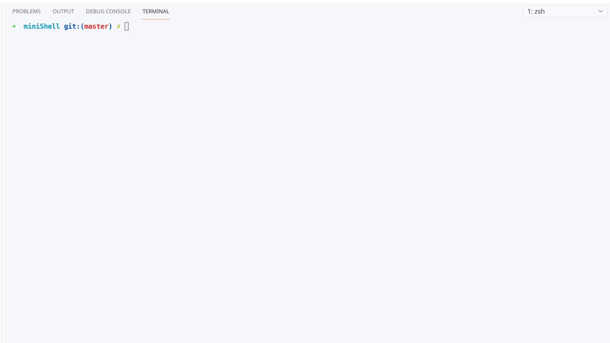

# miniShell
University project where we add to reproduce a shell (mini) in the context of System programming.
So in this context the lexical analysis and tree building were given.
I did not write the lex and yacc code.



# Build
To build the project make, yacc and lex are needed, 
If not installed on your machine you should install those.
Then just run the Makefile
```bash
make
```
Then you can run the executable
```bash
./Shell
```
You can clean the directory with
`clean`

# Functionalities
## Internal commands
Some internal commands are implemented:
* `echo`
* `cd`
* `source`
* `exit`
* `true`
* `false`

## Simple commands
It is possible to execute simple commands `ls -a`

## Sequence of commands
- Evaluation of simple sequences. `ls -al; cat -n file`
- Evaluation of && sequences. `ls && echo success`
- Evaluation of || sequences. `ls || echo fail`

It is possible to combine all those types of commands

## Redirections
- standard output `>`
- standard input `<`
- error outpout `2>`
- error and standard output `&>`
- standard output append `>>`

It is possible to combine all those redirections togethers

## Pipes
Evaluation of pipelines (ls | grep log)

## Background execution
With `&` it is possible to execute a command in the background. `xeyes &`
### Zombies
zombies process are dealed with signal process

